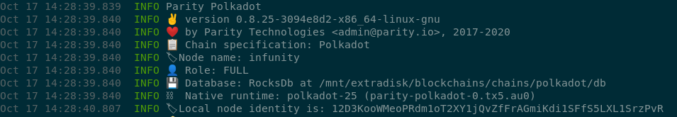
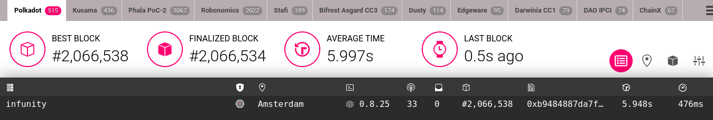
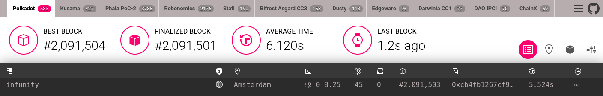

# hackathon: Polkadot 2020
## Run A Kusama Or Polkadot Node And Add It To Telemetry

Task description: https://gitcoin.co/issue/Polkadot-Network/hello-world-by-polkadot/12/100023938

### node started:

### telemetry - synced:

### up time

2091504-2064012 = node has been up at least  27492 blocks  
2091504-2066538 = node has been synced at least 24966 blocks  

### disk space needed

approx 2.2G initially ... right now 3.7G

