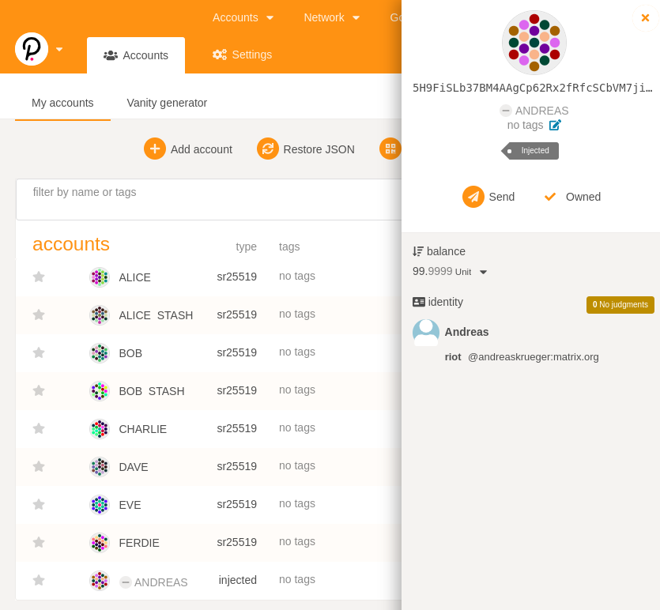

# hackathon polkadot 

### Set An Identity On Kusama Or Polkadot's Development Version

description: https://gitcoin.co/issue/Polkadot-Network/hello-world-by-polkadot/11/100023937

submission screenshot:

result: **"Unable to fulfill bounty. Please try again later"**

emotion: *anger*, *doubts*: why am I wasting my time with this at all?

---

steps:

    ./polkadot --dev

https://polkadot.js.org/apps/?rpc=ws%3A%2F%2F127.0.0.1%3A9944#/explorer

send 100 Units from Alice to my address

my account ... three dots ... Set on-chain-identity

